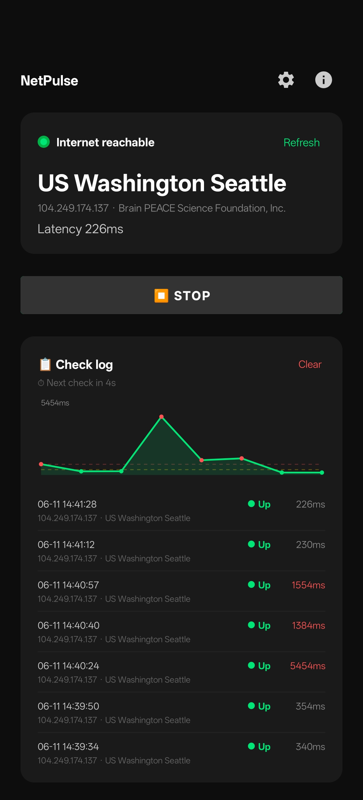

<div align="center">
  <h1>NetPulse</h1>
  <p>
    <strong>Lightweight Connectivity & Exit-IP Monitor for Android</strong>
  </p>
  <p>
    Continuously checks whether the open internet is reachable, shows your current exit IP and its location, and alerts you the moment the connection drops.
  </p>
  <p>
    
  </p>
</div>

<div align="center">


</div>

## About

NetPulse is a small Android utility that runs a foreground service and probes
lightweight `generate_204` connectivity endpoints on a fixed interval. It tells
you at a glance whether you can actually reach the open internet, what your
current exit IP and region are, and keeps a rolling log so you can see exactly
when connectivity — or your exit IP — changed.

It is **not** a VPN and does not tunnel any traffic; it only observes and
reports the state of your existing connection.

## Key Features

- **Reliable reachability check** — probes `generate_204` endpoints and treats only a strict `204 No Content` as success, ignoring captive-portal / hijack pages.
- **Exit IP & geolocation** — shows your current public exit IP, region, and ISP; tap to copy.
- **Persistent status-bar icon** — distinct check / cross / ring glyphs so the state is readable even in the monochrome status bar.
- **Check log** — keeps the last N results (configurable) with timestamp, result, latency, and exit IP; highlights the moment the IP changes.
- **Next-check countdown** and one-tap start/stop.
- **Disconnect alerts** — optional vibration and sound.
- **Bilingual** — English and 中文, with a manual in-app language switch.
- **Auto-restart** on boot when monitoring was active.

## Tech Stack

- **Language:** Kotlin
- **Platform:** Android SDK (minSdk 26 / targetSdk 36)
- **UI:** Material Components, View-based layouts
- **Concurrency:** Kotlin Coroutines
- **CI/CD:** GitHub Actions

## Getting Started

### Install

Grab the latest signed APK from the [Releases](../../releases) page and install
it on your device (you may need to allow installation from unknown sources).

### Build from Source

#### Prerequisites

- JDK 17
- Android SDK (or Android Studio)

#### Build

```bash
git clone https://github.com/ShuttleLab/NetPulse.git
cd NetPulse
./gradlew assembleDebug
# APK at app/build/outputs/apk/debug/app-debug.apk
```

## Releases

Pushing a `v*` tag triggers a GitHub Actions workflow that builds a **signed
release APK** and publishes it to GitHub Releases. See [RELEASE.md](RELEASE.md)
for keystore and signing-secret setup.

```bash
git tag v1.0.0
git push origin v1.0.0
```

## License

NetPulse is licensed under the **GNU Affero General Public License v3.0**.
See [LICENSE](LICENSE) for the full text.

<div align="center">
  Built by <a href="https://github.com/ShuttleLab">ShuttleLab</a>
</div>
